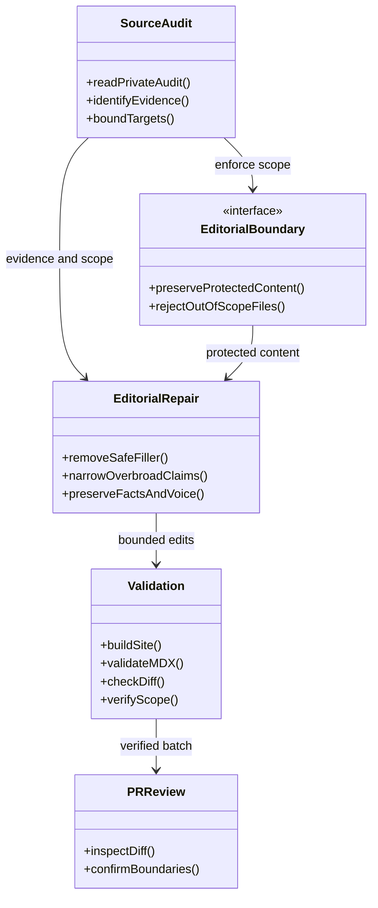
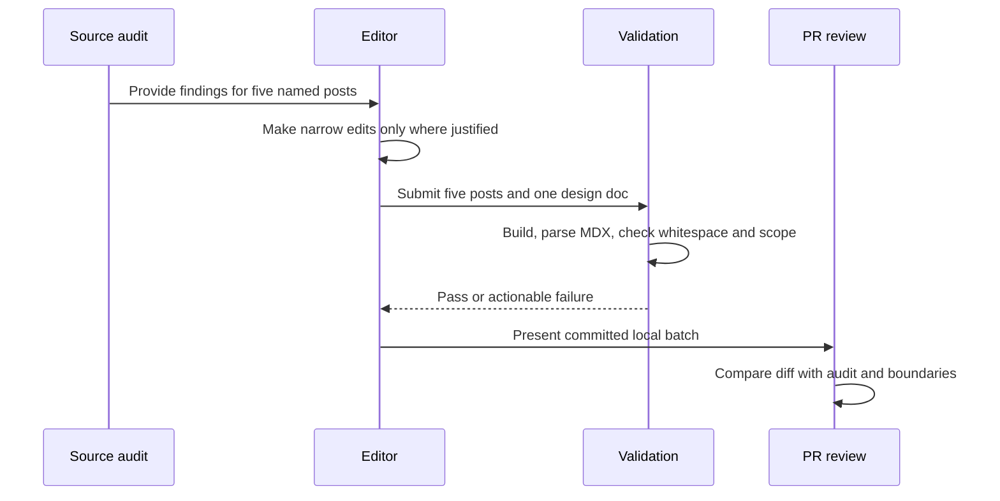
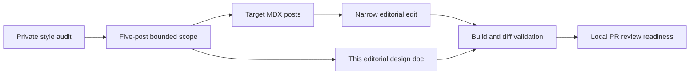
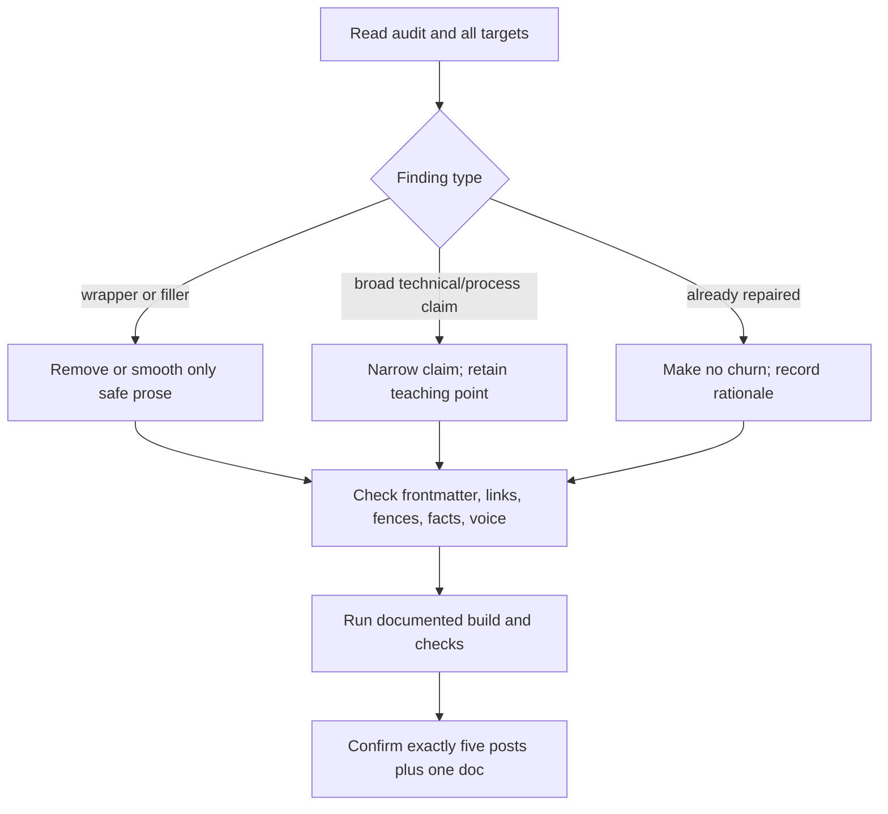

# Five-post editorial repair pipeline

This document scopes one bounded batch: narrow, evidence-led edits to `post24.mdx`, `post30.mdx`, `post31.mdx`, `post41.mdx`, and `post49.mdx`, based on the private style audit. Frontmatter, links, code fences, factual content, and the author's voice remain in scope for preservation. Posts 22, 23, 27, 28, 32, 33, 35, and 36 are explicitly out of scope.

The workflow is editorial review, not software architecture:

## Editorial HLD

## Editorial LLD

